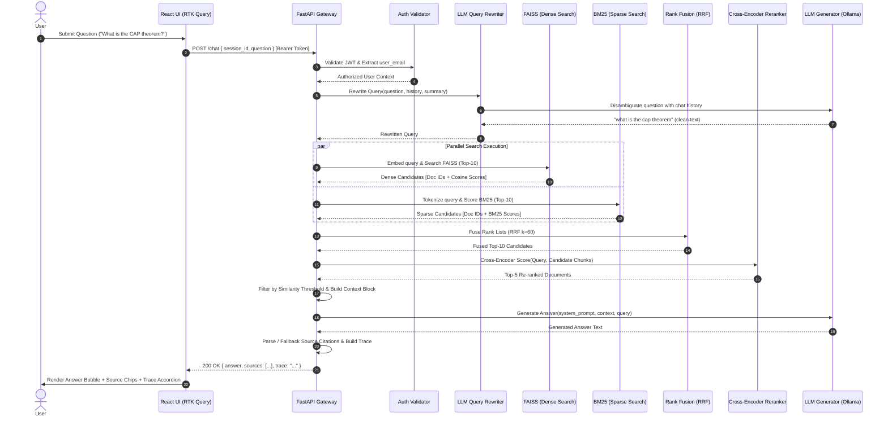

# DocMind Application Flow & Execution Lifecycle

This document details the end-to-end operational flow of the **DocMind (AI Research Assistant)** application. It covers data flow diagrams, sequence flows, state transitions, and step-by-step subsystem execution paths.

---

## Table of Contents
1. [End-to-End High-Level System Architecture](#1-end-to-end-high-level-system-architecture)
2. [Sequence Diagram: User Query & RAG Pipeline](#2-sequence-diagram-user-query--rag-pipeline)
3. [Subsystem 1: Authentication & User Session Lifecycle](#3-subsystem-1-authentication--user-session-lifecycle)
4. [Subsystem 2: Multi-Tenant Ingestion & Indexing Pipeline](#4-subsystem-2-multi-tenant-ingestion--indexing-pipeline)
5. [Subsystem 3: Query Processing & Contextual Disambiguation](#5-subsystem-3-query-processing--contextual-disambiguation)
6. [Subsystem 4: Two-Stage Hybrid Retrieval & Rank Fusion](#6-subsystem-4-two-stage-hybrid-retrieval--rank-fusion)
7. [Subsystem 5: Grounded LLM Generation & Citation Attribution](#7-subsystem-5-grounded-llm-generation--citation-attribution)
8. [Subsystem 6: Frontend State Machine & Cache Lifecycle](#8-subsystem-6-frontend-state-machine--cache-lifecycle)

---

## 1. End-to-End High-Level System Architecture

The DocMind system is partitioned into five distinct layers:
1. **Client / UI Layer:** React 18 + TypeScript SPA with Redux Toolkit (RTK) Query.
2. **API & Security Gateway:** FastAPI async server with Google OAuth 2.0 validation and JWT verification.
3. **Multi-Tenant Application Registry:** Per-user dependency injection holding isolated `DocumentStore`, `KeywordSearch`, and `VectorIndex` instances.
4. **Retrieval & Fusion Engine:** Dense FAISS vector search, sparse BM25 keyword matching, Reciprocal Rank Fusion (RRF), and Cross-Encoder re-ranking.
5. **Local Inference Layer:** Ollama serving quantized open-weights models (`qwen2.5:3b`).

```
 +-----------------------------------------------------------------------------------------+
 |                                  REACT FRONTEND (Vite / MUI)                            |
 |  [Google Login]  -->  [Document Uploader]  -->  [Chat Interface]  -->  [Retrieval Trace] |
 +-----------------------------------------------------------------------------------------+
                                          |
                              HTTP / JSON + JWT Bearer
                                          v
 +-----------------------------------------------------------------------------------------+
 |                              FASTAPI BACKEND GATEWAY                                    |
 |  - JWT Verification & Claim Extraction ("email", "sub")                                 |
 |  - Multi-Tenant Router Dispatch (Dependencies: get_current_user, get_application)        |
 +-----------------------------------------------------------------------------------------+
                                          |
                                          v
 +-----------------------------------------------------------------------------------------+
 |                          MULTI-TENANT USER INSTANCE (Isolated)                          |
 |  Documents: backend/documents/{user_email}/ | Storage: backend/storage/{user_email}/    |
 +-----------------------------------------------------------------------------------------+
     |                                                                 |
     | [Ingestion Mode]                                                | [Query / RAG Mode]
     v                                                                 v
 +-----------------------------+                      +------------------------------------+
 | 1. PDF Text Extraction      |                      | 1. Query Rewriter (LLM + History)  |
 | 2. Structural Chunking      |                      | 2. Dense Search (FAISS IndexFlatIP)|
 | 3. Dense Embedding (BGE)    |                      | 3. Sparse Search (BM25 Okapi)      |
 | 4. Sparse Token Indexing    |                      | 4. Reciprocal Rank Fusion (RRF)    |
 | 5. Disk Persistence (.pkl)  |                      | 5. Cross-Encoder Re-ranker (BGE)   |
 +-----------------------------+                      | 6. Context Builder & Grounding     |
                                                      | 7. Local LLM Generator (Ollama)    |
                                                      | 8. Citation Fallback & Trace Format|
                                                      +------------------------------------+
```

---

## 2. Sequence Diagram: User Query & RAG Pipeline

The diagram below illustrates the exact execution path when a user submits a question:



---

## 3. Subsystem 1: Authentication & User Session Lifecycle

```text
User Action: Click "Sign In with Google"
  │
  ├─► [Frontend] Google OAuth Provider returns `credential` (Google ID Token)
  │
  ├─► [POST /auth/google] Payload: { credential }
  │     │
  │     ├─► `google.oauth2.id_token.verify_oauth2_token(credential, Request(), CLIENT_ID)`
  │     │     ├─ Validates Google digital signature
  │     │     └─ Extracts email, name, picture
  │     │
  │     ├─► Backend signs Application JWT (`HS256`, 7-day expiration)
  │     │     Claims: { "sub": email, "email": email, "name": name, "picture": picture }
  │     │
  │     └─► Returns: { token: "<JWT>", user: { email, name, picture } }
  │
  ├─► [Frontend Storage]
  │     ├─ `localStorage.setItem('token', res.token)`
  │     └─ `localStorage.setItem('user', JSON.stringify(res.user))`
  │
  └─► [Protected API Calls]
        Request Header: `Authorization: Bearer <JWT>`
        FastAPI Dependency: `get_current_user` decodes token and enforces permissions.
```

---

## 4. Subsystem 2: Multi-Tenant Ingestion & Indexing Pipeline

When documents are uploaded via `POST /documents`, they undergo a strict multi-stage transformation:

```text
[Uploaded PDF Files]
       │
       ▼
1. File Storage & Directory Allocation
   - Target Directory: `backend/documents/{user_email}/<filename>.pdf`
   - Validates PDF structure and saves binary stream to disk.
       │
       ▼
2. Page Extraction (`PyMuPDF / fitz`)
   - Traverses document pages: preserves page numbers (1-indexed) and raw text.
   - Outputs: `List[Page]`
       │
       ▼
3. Structural Text Chunking (`Chunker`)
   - Target Chunk Size: 400 words
   - Overlap: 75 words
   - Attaches metadata: `chunk_id`, `source.filename`, `page_number`.
   - Outputs: `List[Document]`
       │
       ▼
4. Dual Index Generation
   ┌─────────────────────────────────────┬─────────────────────────────────────┐
   │ Dense Vector Indexing               │ Sparse Keyword Indexing             │
   │ - Embed via `BAAI/bge-small-en-v1.5`│ - Lowercase tokenization (`.split()`)│
   │ - L2 Normalization (Unit length)    │ - Build `rank_bm25.BM25Okapi` index │
   │ - Insert into `faiss.IndexFlatIP`   │                                     │
   └─────────────────────────────────────┴─────────────────────────────────────┘
       │
       ▼
5. Persistent Storage Serialization
   - `backend/storage/{user_email}/faiss.index` (FAISS dense binary index)
   - `backend/storage/{user_email}/documents.pkl` (Serialized Document chunks)
   - `backend/storage/{user_email}/bm25.pkl` (Serialized BM25 index)
```

---

## 5. Subsystem 3: Query Processing & Contextual Disambiguation

To support complex multi-turn discussions without reference loss, queries pass through the `LLMRewriter`:

```text
User Question: "What are its main limitations?"
Recent Conversation: 
  - User: "How does the Raft consensus algorithm work?"
  - Assistant: "Raft works via leader election, log replication, and safety guarantees..."
Conversation Summary: "User inquired about distributed consensus and Raft mechanics."
       │
       ▼
[Prompt Constructed for LLMRewriter]
       │
       ▼
[LLM Processing (qwen2.5:3b)]
       │
       ▼
Raw Output: "what-are-the-main-limitations-of-the-raft-consensus-algorithm"
       │
       ▼
[Post-Processing & Sanitization]
 - Regex cleaning: `re.sub(r'[-_]', ' ', raw_output)`
 - Strip punctuation and quotation marks
       │
       ▼
Final Rewritten Search Query: "what are the main limitations of the raft consensus algorithm"
```

---

## 6. Subsystem 4: Two-Stage Hybrid Retrieval & Rank Fusion

```text
                        Rewritten Query
                               │
               ┌───────────────┴───────────────┐
               ▼                               ▼
     [Dense Vector Search]           [Sparse Keyword Search]
     - Embed with BGE                - Lowercase & Tokenize
     - FAISS IndexFlatIP (IP)        - BM25Okapi Scoring
     - Retrieve Top-10               - Retrieve Top-10
               │                               │
               └───────────────┬───────────────┘
                               ▼
               [Reciprocal Rank Fusion (RRF)]
               Score(d) = Σ [ 1 / (60 + Rank(d)) ]
                               │
                               ▼
                    Fused Top-10 Candidates
                               │
                               ▼
             [Cross-Encoder Re-Ranking Stage]
             - Model: `BAAI/bge-reranker-base`
             - Inputs: `(Query, Chunk_Text)` pairs
             - Full Cross-Attention Scoring (Logits -> Sigmoid)
                               │
                               ▼
                    Top-5 Ranked Candidates
                               │
                               ▼
             [Similarity Threshold Verification]
             - Filter chunks with score < 0.40
             - Retain high-confidence matches for context
```

---

## 7. Subsystem 5: Grounded LLM Generation & Citation Attribution

```text
[Retrieved & Filtered Chunks]
       │
       ▼
1. Context Building (`ContextBuilder`)
   Formats each passage with clear boundaries:
   ```
   [Document 1]
   Source: system_design.pdf
   Page: 17
   <chunk text content...>
   ```
       │
       ▼
2. System Role Isolation (`AnswerGenerator`)
   - `{"role": "system"}`: Strict persona and hallucination boundaries.
   - `{"role": "user"}`: Grounded context blocks + user question + recency anchor.
       │
       ▼
3. Local LLM Execution (`Ollama / qwen2.5:3b`)
   - Temperature: `0.2` (Low variance, factual answers).
   - Generates streaming or complete response.
       │
       ▼
4. Source Attribution & Citation Fallback
   - **Primary:** Scans output for explicit references like `[system_design.pdf, Page 17]` or `[Document 1]`.
   - **Fallback:** If the LLM omitted explicit inline tags, automatically lists all documents provided in the context that exceeded the similarity threshold.
       │
       ▼
5. Trace Formatting
   - Compiles Original Query, Rewritten Query, Semantic scores, Keyword scores, Fused RRF scores, and Reranked scores into an inspectable Markdown trace block.
```

---

## 8. Subsystem 6: Frontend State Machine & Cache Lifecycle

```text
[App Boot / Navigation]
       │
       ├─► Check `localStorage.getItem('token')`
       │     ├─► [No Token] ──► Redirect to `/login`
       │     └─► [Token Present] ──► Render `<Layout />`
       │
[Document Ingestion Flow]
       ├─► User selects PDF file
       ├─► `useUploadDocumentMutation()` triggers `POST /documents`
       └─► On Success: Automatically invalidates `['Documents']` cache tag 
           ──► Triggers background re-fetch for `<DocumentList />`
       │
[Chat Flow]
       ├─► User clicks "New Chat" ──► Clears UI messages & resets active session
       ├─► User sends message ──► Optimistically appends user message to UI state
       ├─► `useAskQuestionMutation()` triggers `POST /chat`
       ├─► Response received ──► Appends assistant bubble, Source Chips & Trace Accordion
       └─► Abort Trigger ──► User clicks Stop icon ──► Cancels active HTTP request via AbortController
       │
[Logout Flow]
       ├─► User clicks Logout
       ├─► `localStorage.removeItem('token')`
       ├─► `localStorage.removeItem('user')`
       ├─► `dispatch(apiSlice.util.resetApiState())` (Purges all RTK Query memory cache)
       └─► Navigate to `/login`
```

---

## 9. Summary of Key Performance Parameters

| Component | Technology / Model | Configuration / Metric |
| :--- | :--- | :--- |
| **Embedding Model** | `BAAI/bge-small-en-v1.5` | 384 Dimensions, Normalized L2 |
| **Vector Index** | `faiss.IndexFlatIP` | Exact Cosine Similarity, < 2ms latency |
| **Keyword Search** | `rank_bm25.BM25Okapi` | Lowercase exact-token matching |
| **Rank Fusion** | Reciprocal Rank Fusion (RRF) | Smoothing constant $k = 60$ |
| **Reranker** | `BAAI/bge-reranker-base` | Cross-Encoder, Top-5 selection |
| **Chunking** | Custom Slotted Chunker | 400 words/chunk, 75 words overlap |
| **LLM Inference** | Ollama (`qwen2.5:3b`) | Local inference, Temperature 0.2 |
| **Authentication** | Google OAuth 2.0 + PyJWT | 7-day expiration, HS256 algorithm |
